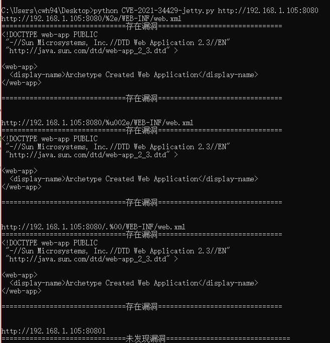

# JETTY CVE-2021-34429

## 通过四个POC可以同时检测多个JETTY漏洞

~~~ 检测漏洞
    CVE-2021-34429
    CVE-2021-28164
    CVE-2021-28169
~~~

## Python版本

~~~ 运行版本
本POC使用python3运行
~~~

## 安装依赖

~~~ 使用依赖
    urllib.request
    urllib.parse
    sys
~~~

## 使用方法

~~~使用方法
    python3 CVE-2021-34429.py http://192.168.1.105:8080 #目标jetty地址
~~~

